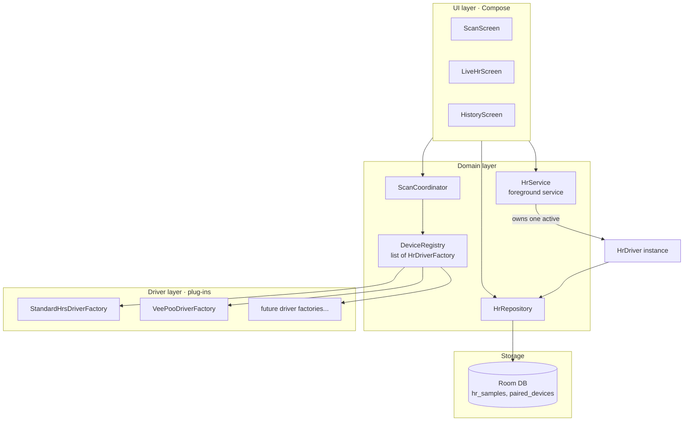

# HeartBeets — Architecture

> Scope: live heart-rate ingestion only. The music engine and social features are
> separate concerns layered on top of this foundation and will get their own
> documents when their time comes.

## Goals

1. **Live, low-latency** heart-rate from BLE wearables — measured per-beat, not cached
   summaries.
2. **Multiple device families** behind one uniform interface, so the rest of the app
   never branches on "which wearable."
3. **Easy to add a new device family** — drop a new driver into the registry, no
   changes to UI, scanner, persistence, or service code.
4. **Standard HRS (`0x180D`) as the default**, vendor protocols as plug-in drivers
   for devices that don't speak the standard.
5. **R-R intervals captured from day one** so the future music engine can use HRV
   without a schema migration.

## Non-goals (for the HR layer)

- Health Connect, Google Fit, Samsung Health — these are not live.
- ANT+ — needs hardware most Android phones don't have.
- iOS / Apple Watch — out of platform.
- Wear OS — possible later, not in scope now.

## High-level shape



## Core abstractions

### `HrSample`
Immutable value object emitted by every driver:

| Field | Type | Notes |
|---|---|---|
| `bpm` | `Int` | Beats per minute, as reported by the device. |
| `timestamp` | `Long` | `System.currentTimeMillis()` when the sample was received. |
| `rrIntervalsMs` | `IntArray?` | Optional. Time between successive R-peaks in ms. Standard HRS provides them in the same notification when bit 4 of the flags byte is set. Vendor drivers populate when available. |
| `energyExpendedKj` | `Int?` | Optional, from Standard HRS flags. Rarely populated; kept for completeness. |
| `contactDetected` | `Boolean?` | Optional. Whether the device reports skin contact. Useful to flag stale readings. |
| `source` | `SourceTag` | Driver id + device address. For debugging and history. |

### `HrDriver`
The contract every device family implements. Coroutine-friendly, all observation via Flows.

```kotlin
interface HrDriver {
    val deviceAddress: String
    val displayName: String
    val state: StateFlow<ConnectionState>     // DISCONNECTED, CONNECTING, CONNECTED, ERROR
    val samples: SharedFlow<HrSample>
    val battery: StateFlow<Int?>              // 0-100, null if unknown
    suspend fun connect()
    suspend fun disconnect()
}
```

### `HrDriverFactory`
What the registry holds. Knows how to recognise its devices and how to build a
driver for one.

```kotlin
interface HrDriverFactory {
    val id: String                            // e.g. "standard-hrs", "veepoo"
    val displayName: String                   // shown in UI
    val manufacturerHint: String              // "Generic", "VeePoo", ...
    val iconRes: Int

    fun matches(scan: BleScanResult): Match   // EXACT, LIKELY, NO

    fun create(context: Context, address: String, name: String?): HrDriver
}

enum class Match { EXACT, LIKELY, NO }
```

`matches()` is the auto-detection mechanism. The scanner asks every factory in
the registry; the highest-confidence match wins. `EXACT` for "this device
advertises my service UUID" or "matches a name pattern I own", `LIKELY` for
softer hints, `NO` otherwise.

### `DeviceRegistry`
Singleton. Holds the list of registered factories. New device families plug in
by adding one line at app startup:

```kotlin
DeviceRegistry.register(StandardHrsDriverFactory())
DeviceRegistry.register(VeePooDriverFactory())
```

### `ScanCoordinator`
Wraps `BluetoothLeScanner`. Streams scan results, asks the registry for matches,
emits `DiscoveredDevice(scanResult, bestFactory, matchConfidence)`. Pure read;
does not connect.

### `HrService`
A foreground service. Owns at most **one active `HrDriver`** at a time. Keeps
the BLE connection alive while the screen is off. Persists every sample via
`HrRepository`. Exposes a binder for the UI.

This is the only place where lifecycle / power management lives. Drivers don't
know about Android services; they just connect and emit.

### `HrRepository`
Thin facade over Room. Two responsibilities:
- Persist `HrSample`s to the `hr_samples` table.
- Manage the `paired_devices` table (last connected device, last factory id, last
  known name/address) so we can auto-reconnect on app start.

## Data model (Room)

```kotlin
@Entity(tableName = "hr_samples")
data class HrSampleEntity(
    @PrimaryKey(autoGenerate = true) val id: Long = 0,
    val deviceAddress: String,
    val driverId: String,
    val bpm: Int,
    val timestamp: Long,
    val rrIntervalsMs: String?,    // CSV "812,798,815" — small, simple, indexable later if needed
    val contactDetected: Boolean?,
    val sessionId: Long            // FK to hr_sessions
)

@Entity(tableName = "hr_sessions")
data class HrSessionEntity(
    @PrimaryKey(autoGenerate = true) val id: Long = 0,
    val deviceAddress: String,
    val driverId: String,
    val startedAt: Long,
    val endedAt: Long?
)

@Entity(tableName = "paired_devices")
data class PairedDeviceEntity(
    @PrimaryKey val address: String,
    val name: String?,
    val driverId: String,
    val lastConnectedAt: Long
)
```

A "session" is a continuous connection. Disconnects close it. New connect opens
a new session. Sessions are the granularity for graphs and exports later.

## Permissions and Android plumbing

`minSdk = 31` (Android 12), so we use only the modern permission set:

```xml
<uses-permission android:name="android.permission.BLUETOOTH_SCAN"
    android:usesPermissionFlags="neverForLocation"
    tools:targetApi="s" />
<uses-permission android:name="android.permission.BLUETOOTH_CONNECT" />
<uses-permission android:name="android.permission.FOREGROUND_SERVICE" />
<uses-permission android:name="android.permission.FOREGROUND_SERVICE_HEALTH" />
<uses-permission android:name="android.permission.POST_NOTIFICATIONS" />
```

`neverForLocation` on `BLUETOOTH_SCAN` matters: it tells the system we don't use
BLE for location inference, so we don't have to request `ACCESS_FINE_LOCATION`.
This requires us not to filter scans by anything that could imply location, so
factories that need to filter by raw advertisement data should do it
post-scan, not via `ScanFilter`.

`FOREGROUND_SERVICE_HEALTH` is the appropriate type for an HR foreground service
on Android 14+.

## Why this shape

This is essentially Gadgetbridge's `DeviceCoordinator` + `DeviceSupport` pattern,
distilled down to the HR-only slice and rewritten in Kotlin with coroutines and
Flow. The reasons it's the right shape:

- **The protocol is the abstraction boundary**, not the device. Two devices that
  speak the same protocol share a driver. New devices in an existing family =
  one new pattern in the factory's `matches()`, zero code changes elsewhere.
- **Drivers don't know about Android services or persistence.** They produce a
  stream. Anything else is the service's problem.
- **The scanner doesn't know about device families.** It asks. New family added,
  scanner picks it up automatically.
- **One active driver per session** removes the multi-source fallback chains
  that turned RythmOfLife's HR layer into spaghetti.

## Why we don't reuse RythmOfLife code as-is

The RythmOfLife audit found:
- Decompiled APKs (`HbandApK/`, `qwatch_decompiled/`) — license unsafe.
- VeePoo SDK source dump (`hband_sdk/`, `temp_*/`) — license unclear,
  and the SDK has the CCCD bug that broke HR notifications anyway.
- Ad-hoc multi-manager pattern with no abstraction.

What we *do* reuse:
- The **VeePoo wire protocol** (A1/D0/D8/F4/A0 commands) — public information,
  documented in `RythmOfLife/HEART_RATE_CONTROL_STATUS.md`. Reimplemented over
  native `BluetoothGatt` so the CCCD bug is gone.
- **The Standard HRS driver shape** in `BleHeartRateClient.kt` as design
  reference — modernised as coroutines/Flow, written from scratch in HeartBeets.

## Why we don't copy from Gadgetbridge

Gadgetbridge is **AGPL-3.0**, HeartBeets is **Apache-2.0**. AGPL would force
HeartBeets to be AGPL too, which restricts distribution. So we read Gadgetbridge
as **public protocol documentation** — their drivers describe how each vendor's
protocol works — and we write our own Kotlin code from those notes. This is
standard clean-room practice and is the same way most cross-platform BLE work
gets done.

## Future surfaces (out of scope here, sketched for context)

- **Music engine** consumes `HrService`'s sample flow + a window of recent
  samples for HRV. Talks Oboe / AAudio. Lives in a separate module.
- **Listening detection** (ported from VibeIn, Apache-2.0, low coupling) feeds
  the music engine genre/style preferences in Phase 2.
- **Social** (Phase 3) adds a thin Firebase backend that relays the same sample
  flow to friends; locally the architecture doesn't change.
